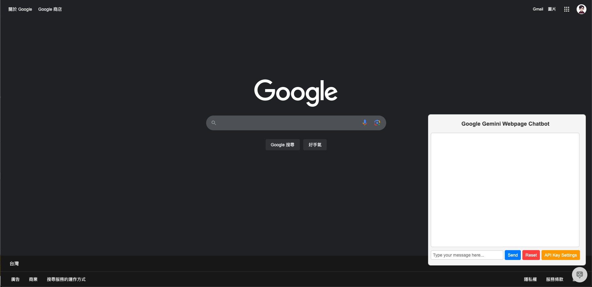
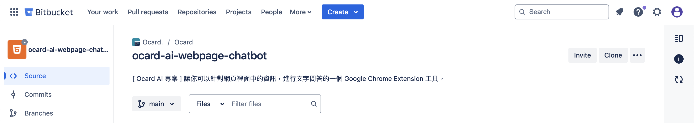
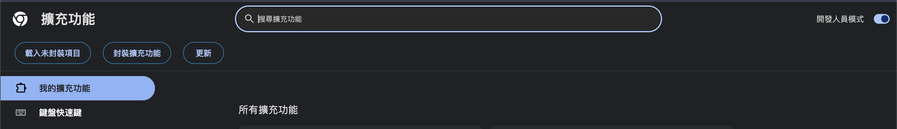
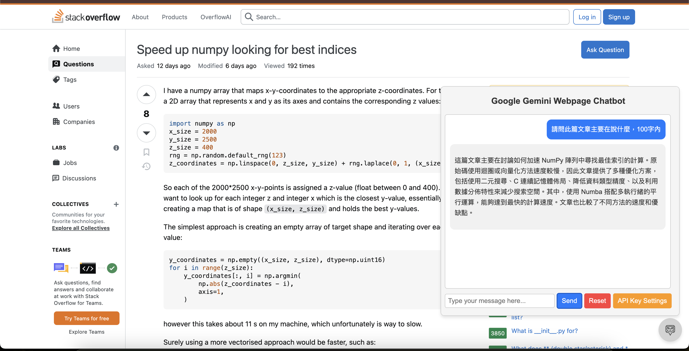
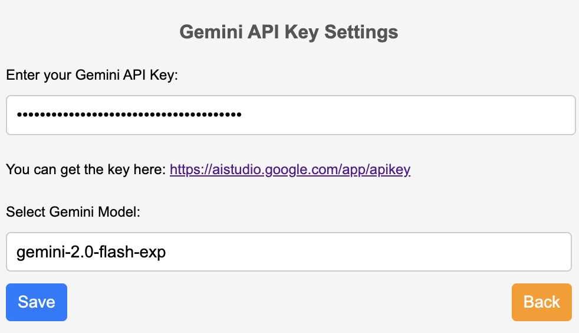
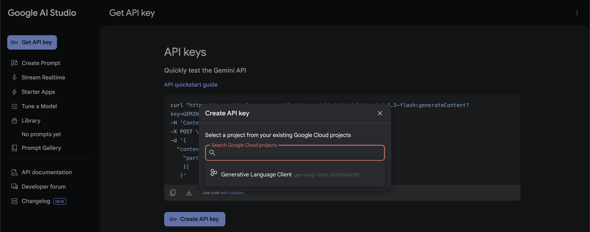
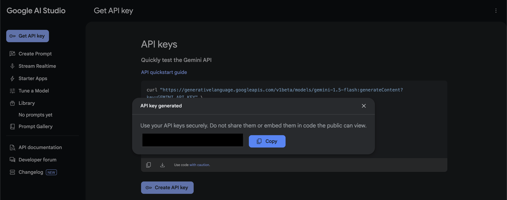

# Gemini Webpage Chrome Extension
(Content generated by AI and revised)

[中文版 README.md](README-CH.md)



## Overview

**Gemini Webpage Chrome Extension** is a tool designed to extract textual content from the HTML `<body>` of any webpage and leverage Google Gemini for question-and-answer processing. This extension enables users to seamlessly interact with webpage content, making it easy to query and understand.

## Features

- Extract textual content from the HTML `<body>` of webpages.
- Use Google Gemini to summarize, analyze, or answer questions based on webpage content.
- One-click popup interface for operations.

## Installation

1. Clone the repository:
   ```bash
   git clone https://github.com/LiuYuWei/gemini-webpage-chrome-extension
   ```
   

2. Open Google Chrome and navigate to `chrome://extensions/`, then enable "Developer Mode" (toggle in the upper right corner).
   

3. Click "Load unpacked," select the project directory, and once imported, the extension will appear in the toolbar.
   

4. Click "API Config Settings" and select the [API Key link](https://aistudio.google.com/app/apikey).
   

5. Apply for a Google Gemini API Key within the free quota and fill it back into the configuration file.
   
   

6. You can now start interacting with webpages using the Q&A feature.
   

## Usage

1. Navigate to any webpage.

2. Use the popup interface to interact with the chatbot for Q&A.

**Note:** Not all websites support chatbot Q&A. This Chrome Extension does not guarantee compatibility.

## License

This project is licensed under the MIT License. See the LICENSE file for details.

## Author

Simon Liu – 劉育維

- GenAI GDE from Taiwan

- AI Engineer/Architect

- LinkedIn Profile: [Link](https://linkedin.com/feed/simonliuyuwei)

Feel free to contribute by submitting issues or pull requests!

